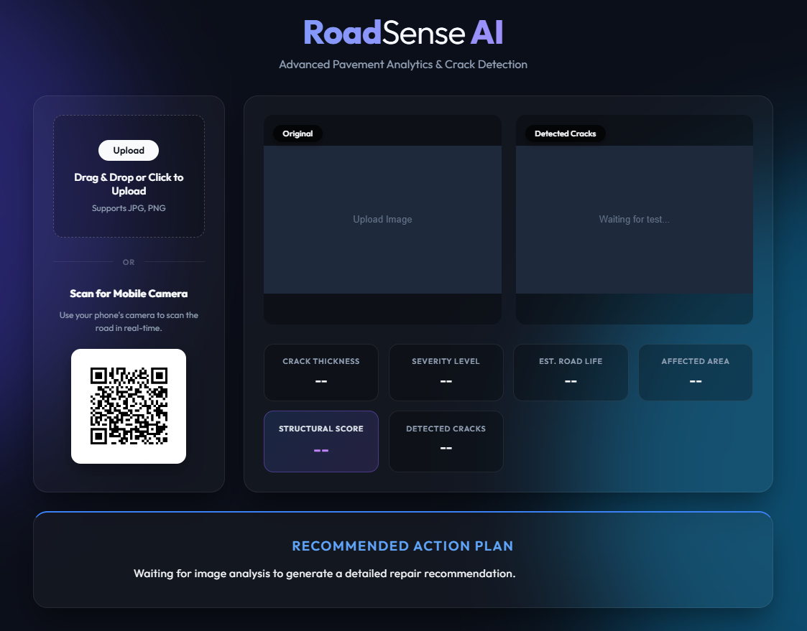
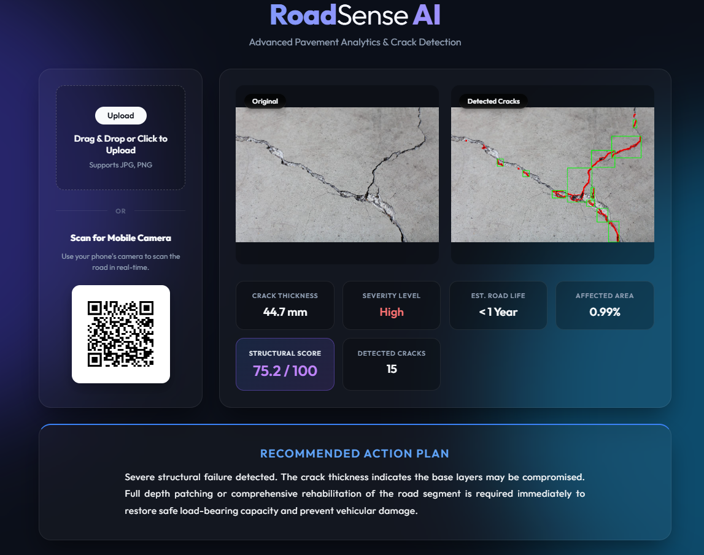

# RoadSense AI: Automated-Road-Crack-Detection-using-OpenCV

An end-to-end Python Computer Vision application for detecting, analyzing, and structural-scoring road cracks. It features a modern Flask web dashboard and a seamless **QR code mobile scanner** that connects smartphone cameras directly to the local AI processing server.

## 🚀 Features

### Beautiful Web Dashboard
<div align="center">
  
</div>

### Flawless Object Localization
<div align="center">
  
</div>

*   **Advanced Crack Detection:** Uses classical Computer Vision (OpenCV) algorithms including Logarithmic Transforms, Bilateral Filtering, Canny Edge Detection, and Morphological operations to explicitly isolate crack pixels.
*   **Object Tracking UI:** Highlights exact structural faults in **solid red** and draws **neon green bounding boxes** around major cracks for clear visualization.
*   **Quantitative Analytics:** Automatically calculates:
    *   Crack Thickness (mm)
    *   Severity Level
    *   Affected Area Percentage
    *   Estimated Road Life
    *   Detected Crack Count
    *   Overall Structural Score (0-100)
    *   Actionable Repair Recommendations
*   **Mobile Camera Integration:** Automatically generates a local network QR code on the desktop dashboard. Scan it with any iOS/Android device to upload road damage pictures from your phone directly to the AI for processing.

## 🛠️ Technology Stack
*   **Backend:** Python, Flask, Werkzeug
*   **Computer Vision:** OpenCV (`cv2`), NumPy, Matplotlib
*   **Frontend:** HTML5, CSS3, JavaScript (Fetch API)
*   **Networking:** Socket, QRcode

## ⚙️ Installation & Setup

1.  **Clone the Repository**
    ```bash
    git clone [https://github.com/SomaseSahil/RoadSense-AI-Automated-Road-Crack-Detection-using-OpenCV]
    ```

2.  **Install Dependencies**
    It is highly recommended to use a virtual environment.
    ```bash
    pip install -r requirements.txt
    ```

3.  **Run the Server**
    ```bash
    python app.py
    ```

4.  **Access the Dashboard**
    Open your web browser and go to `http://127.0.0.1:5000`

## 📱 How to use the Mobile Scanner

1. Ensure your smartphone and your desktop/laptop are connected to the **same Wi-Fi network**.
2. Run the server using `python app.py` on your computer.
3. Open the Dashboard at `http://localhost:5000`
4. Use your phone's camera (or Google Lens / QR Scanner app) to scan the QR code displayed on the screen.
5. Take a picture of the road. It will automatically upload to your PC and process the results on the dashboard within seconds!

## 🧠 Underlying Algorithm
Unlike black-box Deep Learning models, this system uses deterministic classical image processing. This makes it incredibly lightweight and fast.
1. `cvtColor` -> Grayscale Conversion
2. `cv2.blur` -> Noise Averaging
3. `np.log` -> Contrast Enhancement
4. `cv2.bilateralFilter` -> Edge-Preserving Smoothing
5. `cv2.Canny` -> Edge Detection
6. `cv2.morphologyEx` -> Morphological Closing to connect fragmented lines
7. `cv2.findContours` -> Extraction of geometrical shapes
8. `cv2.boundingRect` -> Filtering and Object Localization

## 📜 License
This project is open-source. Feel free to use and modify the code.

## 👤 Author
**Sahil Somase**
